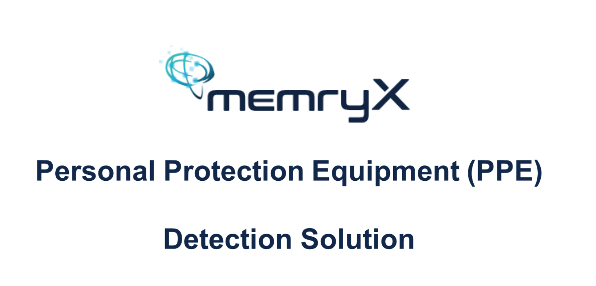

## PPE Demo from MemryX

This demo showcases a Personal Protective Equipment (PPE) detection application using the YOLOv8n model with 512x512 input resolution. The system is designed to predict and classify individuals based on their safety compliance in real-time video streams or images. The model identifies three categories:

- **Safety**: The person is wearing both a helmet and a vest.
- **Half-Safety**: The person is wearing either a helmet or a vest, but not both.
- **Non-Safety**: The person is wearing neither a helmet nor a vest.

By leveraging advanced object detection capabilities, the application helps monitor and enforce safety protocols in industrial or construction environments, ensuring that personnel adhere to required safety standards.

## MemryX MX3 Accelerator
- **High-Efficiency AI Inference** : Utilizes a unique dataflow architecture with at-memory computing, enabling fast and power-efficient AI model inference.
- **Seamless Integration** : Connects to host systems via standard PCIe or USB interfaces, supporting x86, ARM, and RISC-V processors on both Windows and Linux platforms.
- **Full AI Offloading** : Handles all AI inference on-chip, requiring the host only for pre- and post-processing, which simplifies software development and deployment.

## Requirements

1. Ensure your host machine is equipped with a [MemryX MX3 module](https://developer.memryx.com/get_started/hardware_setup.html).
2. Follow the installation instructions at [MemryX Developer Hub](https://developer.memryx.com/get_started/install.html) to install the MX3 driver. Verify that the driver is successfully installed on your device before proceeding.
3. X11 Display Support: Facilitates seamless rendering of model outputs directly to a host display from inside the container environment.
4. (Optional) **USB Camera Access**:  
    The application can utilize a connected USB camera for live streaming PPE detection. Ensure your camera is plugged in and accessible to the container for real-time video inference.

## How to build

1. **Download the Docker Image**  
    Download the Docker image from [this link](https://drive.google.com/file/d/15pgzw-eXDjuaJJjCXAuB7WoZom7jjiPz/view?usp=sharing).
    
    ### About the Docker Image

    The provided Docker image is designed for seamless deployment and execution of the PPE detection demo on Ubuntu 24.04 host systems. The container comes pre-installed with all necessary dependencies, including:

    - **MemryX Runtime SDK 1.2**: Enables efficient interaction with the MemryX MX3 accelerator.
    - **Qt Development Tools**: Includes `qtbase5-dev` and `qt5-qmake` for building and running the graphical user interface.
    - **OpenCV Development Libraries**: `libopencv-dev` for image and video processing tasks.
    - **CMake**: Facilitates building C++ projects within the container.
    - **ONNX Runtime v1.18.1**: Provides high-performance inference for ONNX models.

    This Docker image provides a ready-to-use environment for running the PPE detection application, eliminating the need for manually installing dependencies.


2. **Load a prebuilt Docker image**  
    Load docker image by using:
    ```bash
    docker load -i memryx_demo.tar
    ```


## How to run
1. **Run the PPE detection with video**  
    Start the container with (or use the provided script `scripts/run_ppe_video.sh`):
    ```bash
    xhost +local:root
    docker run -t -i --rm\
        --privileged=true\
        --network="host"\
        -e DISPLAY=$DISPLAY\
        -v /tmp/.X11-unix:/tmp/.X11-unix\
        --name test memryx:demo \
        bash -c "cd /home/PPE/build && ./yolov8_ppe"
    ```

2. **Run the PPE detection with camera streaming**
    Start the container with (or use the provided script `scripts/run_ppe_camera.sh`):
    ```bash
    xhost +local:root
    docker run -t -i --rm\
        --privileged=true\
        --network="host"\
        -e DISPLAY=$DISPLAY\
        -v /tmp/.X11-unix:/tmp/.X11-unix\
        --name test memryx:demo \
        bash -c "cd /home/PPE/build && ./yolov8_ppe -c ../configs/YOLOv8n_PPE_usbcam.txt"
    ```

## Example Inference Result
Below is an example of the PPE detection output. The system highlights detected individuals and classifies their safety compliance in real-time:
    

